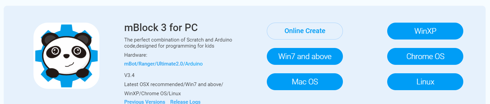

Chapter 1 : 엠봇 설정하기
===================================

엠봇을 설정해 봅시다.

1.1 mblock 다운로드,인스톨,연결하기
------------------------------------------------------------

mblock3는 scratch 기반에 블락 코딩 프로그램입니다.
아래 사이트에서 받으시면 됩니다.

http://www.mblock.cc/mblock-software/

인스톨 한후 프로그램을 실행합니다.
실행한 후  연결 - 아두이노 드라이버 설치 를 누릅니다.

엠봇을 연결한 후 PC나 태블릿의 USB에 꽂습니다.
그런 다음 연결-시리얼포트 클릭하면 해당 포트가 나타나게 됩니다.
해당 포트는 꽂았을때와 안 꽂았을때를 확인해서 해당 포트를 확인해야 합니다.

그러면 다음처럼 연결되었다고 상단에 뜨게 됩니다.

그리고 해당 모델에 맞게 보드 설정을 해야 합니다.
해당 보드를 선택하면 기본적인 확장 프로그램이 나타나고 아이콘이 녹색으로 바뀌게 됩니다.

1.2 mblock 실행 및 펌웨어 업로드
------------------------------------------------------------

2가지 형태로 mbot을 동작시킬 수 있다.
mbot의 경우 motor가 동작 되려면 전원을 일단 넣어줘야 한다.
그런다음 리모콘 A 모드로 하면 리모트 mblock 제어가 일단 된다.

mblock 제어
~~~~~~~~~~~~~~~~~~

다음처럼 scratch block으로 제어 하고 실제 동작되는 블락은 mblock으로 제어를 하면 제어가 된다.

만약에 mblock으로 제어가 안되면 다시 한번 펌웨어를 다운 받길 바란다.

펌웨어 업그레이드는 기본적으로 mblock IDE에서 제어 하도록 설정되어 있다.

만약 리모콘 모드로 A,B,C 를 실행하고자 한다면

다시 기본 프로그램 재설정을 한후 A를 선택한후 제어해도 된다.

아두이노 펌웨어 제어
~~~~~~~~~~~~~~~~~~~~~
또다른 모드는 아두이노 펌웨어를 업로드해서 실행하는 방법이다.
mblock IDE에서 아두이노 모드로 설정한다.

아두이노 모드로 설정하게 되면 데이터,제어,연산,로보트 블럭만 오픈된다.

그리고 로보트의 엠보트 프로그램이 기본 실행되는 블럭이다.

이렇게 설정되면 오른쪽 상단에 아두이노에 업로드 라는 단추를 누르면 해당 코드가 mbot에 업로드 된다.

아두이노 모드로 프로그램 실행한후
다시 처음으로 리셋을 하려면 연결 - 기본프로그램설정으로 다시 다운로드 한다.

1.3 USB 연결 또는 WiFi 연결
------------------------------------------------------------

펌웨어 업그레이드나 기본 설정프로그램 업로드할때는 기본적으로 USB 연결한후 실해해야 한다.

프로그램 실행시에는 USB 또는 블루투스 또는 Wifi로 연결해서 쓰면 된다.

다음 3가지 방법에 대해서 알아 보자.

USB 연결
~~~~~~~~~~~~~~

mblock IDE를 실행했을때 상단 바에 끊어진 상태이어야 한다.

그런 다음 연결- 시리어 포트 - 포트 를 연결한다.

2.4 GHz 모듈
~~~~~~~~~~~~~~

로봇에 2.4 GHz 모듈은 꽂는다.
로봇 전원은 넣는다.
2.4 GHz 모듈 버튼을 누른다.
동글을 PC에 꽂는다.
모듈에 LED가 깜박임이 없어지면 둘간의 페어링이 된것이다.

블루투스 모듈
~~~~~~~~~~~~~~

블루투스 모듈은 찾기를 해서 연결하면 된다.
또는  PC에서 블루투스 연결후 - 시리얼 연결이 가장 안정적이다.

.. image:: ./img/chapter1-15.png

PC에서 블루투스 페어링이 되면 mblock IDE에서는 시리얼 포트가 하나 더 생긴다.

