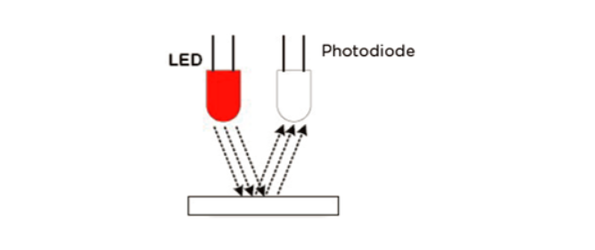
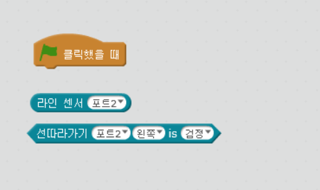
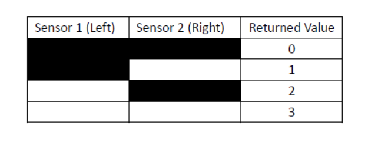
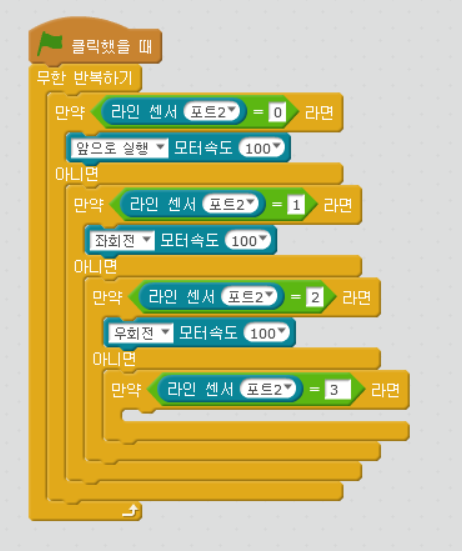
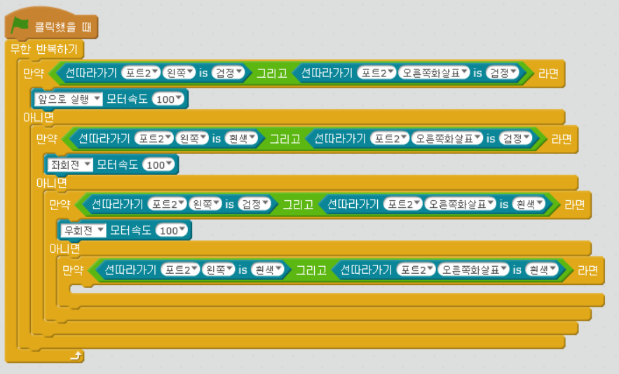

chapter 10: 라인트레이서 센서
========================================

라인트레이서 센서에 대해서 알아보자.

라인드레이서 센서는 1~2cm 범위안에 있는 하얀색을 감지하는 2가지의 센서가 있다.
한쪽은 IR 불빛을 내고 다른 한쪽은 빛의 양을 감지하는 것이다.
반사빛이 약하면 검은색으로 인식되는것이다.
검은색은 빛을 흡수하기때문에 반사되는 양이 적어진다.

mblock에는 라인트레이서 센서 관련 2개의 블럭이 있다.

상기에서 첫번째 블락은 다음 표에 의해서 0~3 값을 리턴하게 된다.

그리고 두번째 블락은 True or False를 리턴하게 된다.

다음 알고리즘을 가진 프로그램을 짜보자.

If( line follower = 0)
---- Go forward
Else if (line follower = 1)
---- Turn Left
Else if(line follower = 2)
---- Turn Right
Else if(line follower = 3)
---- Aaargh!! Help!! Where is the line?

리로트 mblock IDE로 제어를 하게 되면 바로 동작이 안되어 라인을 이탈하는 경우가 발생된다.
이럴경우는 적당한 시간의 지연이 필요하다. mblock 과 엠봇이 통신하는 시간차가 나기때문이다.
이럴때는 프로그램 업로드 모드로 동작하면 바로 실행될 수 있다.

다음은 사이드가 블랙인지 화이트인지를 다 적용하는 알고리즘으로 짜보도록 하자.

If((Right is black) AND (Left is black))
---- Go forward
Else if((Right is white) AND (Left is black))
---- Turn Left
Else ((Right is black) AND (Left is white))
---- Turn Right
Else ((Right is white) AND (Left is white))
---- Aaargh!! I’m lost AGAIN?!?

여기에서는 다음 AND 연산자를 이용한다.

라인 센서 튜닝
-------------------------
1.엠봇이 회전이 매끄럽지 못하다 원인을 알고 있는가? 고칠수 있겠는가?

2.원탁을 떨어지지 않고 따라가게 프로그램할 수 있는가?(빛을 반사하거나 반사하지 못하는것으로 판단)

3.초음파 센서랑 라인센서를 동시에 처리할 수 있게 프로그램 할 수 있는가?

