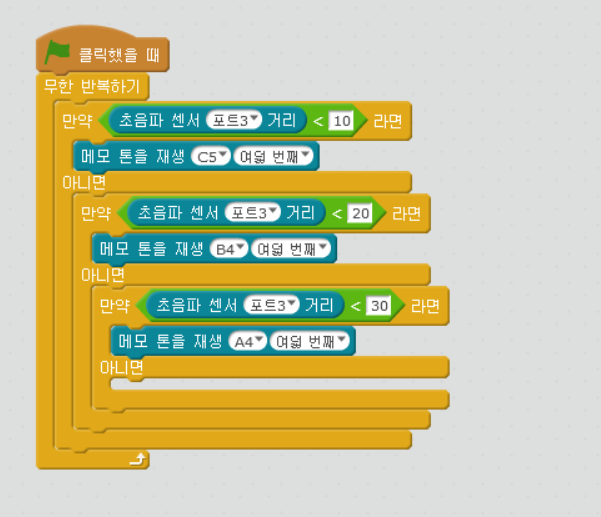

chapter 11: 음악 지휘자
========================================

theremin은  음악가의 손의 움직임에 따라서 음악을 연주하는 악기이다.
엠봇도 초음파 센서를 통해서 구현해 보자.
다음 알고리즘으로 프로그래밍을 해보자.

If an object is less than 10cm away
---- Play a high note
Else If an object is less than 20cm away
---- Play a lower note
Else If an object is less than 30cm away
---- Play a lower note
Else If...

나만의 theremin 만들기
-------------------------
1.본인의 거리에 맞게 조절하고 음악도 변경해 보자.

2.높은 음이 빨리 소리가 끝나고 낮은 음이 좀더 오래 진행되는데 해결할 수 있는가?

