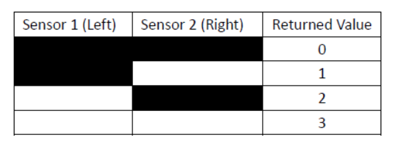
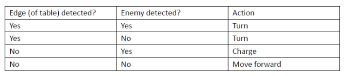
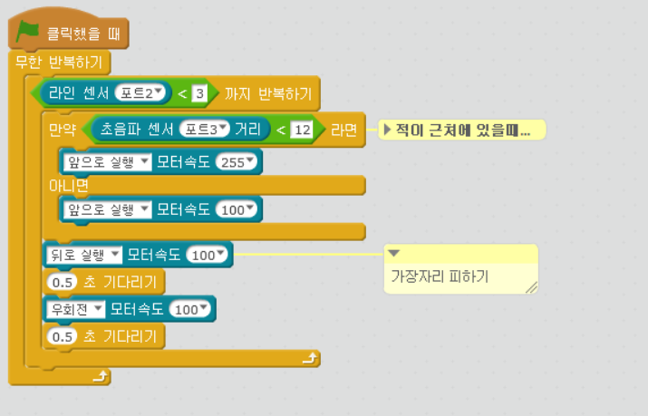

chapter 12: 수모 엠봇
========================================

일본 전통 씨름인 수모로 엠봇을 코딩해 보자.
초음파 센서로 적을 발견할때까지 이동하고 적을 만나면 공격하는것이다.
라인트레이싱 센서를 이용하여 테이블의 가장자리를 인식하고 적을 발견했을때
다음 표를 보고 프로그래밍 하자.

다음 알고리즘을 가지고 프로그래밍 하도록 하자.

Forever {
---- While (the robot has not detected an edge) {
---- ---- If (an enemy is detected)
---- ---- ---- Charge
---- ---- Else
---- ---- ---- Move forward
---- }
---- Turn
}

수모 엠봇 추가 과제
-------------------------
1.다른 행동에 대해서 LED와 부저를 사용해 보자.

2.경기를 좀 더 잘 할 수 있도록 프로그램 할 수 있는가?

