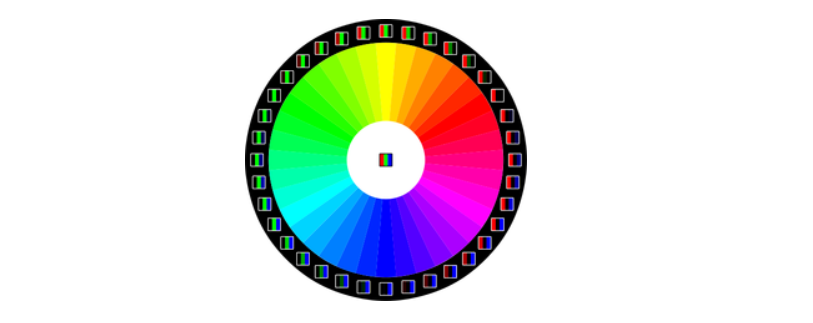
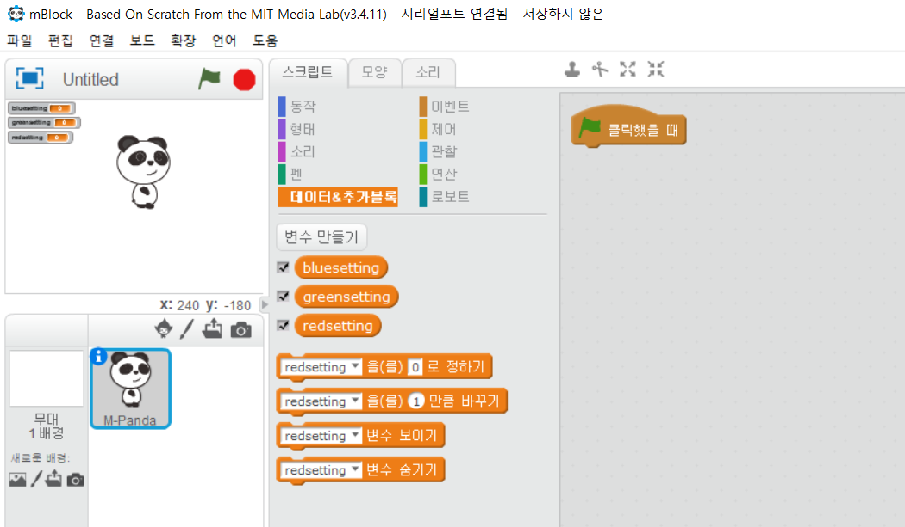
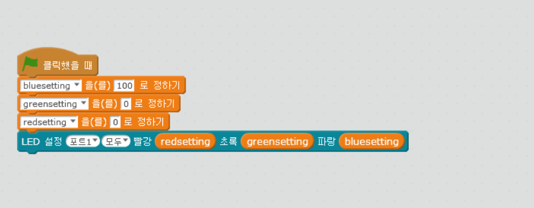

chapter 13: 변수로 칼라값 변경하기
========================================

엠봇에 달려있는 2개의 LED는 3개의 다른 RED,Green,Blue가 색깔을 조합하게 되어 있다.
각각 할당값은 0~255값을 넣을 수 있다.

이 장에서는 상기에 있는 휠 색깔을 만들어 보자.
위에서 보듯이 한색깔을 줄이고 다른 색깔을 늘리면 다른 색깔로 전환이 된다.
다음 알고리즘으로 프로그래밍을 해보자.

Set LED to blue.
Repeat until fully green:
---- level of blue.
---- Increase level of green.

여기서 문제가 발생한다 일단 LED값을 지정하면 변경해야 되는데 이럴때 변수를 이용해서
값을 다른 색깔로 변화시켜야 한다.
다음처럼 변수를 만들어 보자.

그림처럼 blue LED값을 100으로 하고 나머지는 0 으로 한다.

파란색은 -1씩 증가하고 그린 색깔은 1씩 증가하도록 프로그래밍 되어있다.

추가 과제
-------------------------
1.어느 하나의 칼라값을 점차 사라지도록 할 수 있는가?

2.빛이 사라짐에 따라서 빛 감지 센서값을 출력해 보자.

