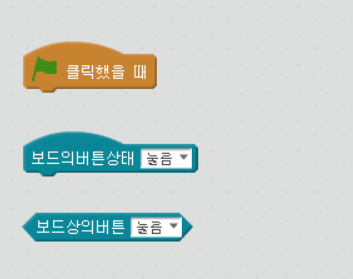

chapter 14: 온보드 버튼 과 타이머
========================================

엠봇에는 버튼이 하나 있고 이와 관련된 블럭이 2개 있다.
하나는 헤더 블럭이고 하나는 블리언 블락이다.
헤더 블락은 어떤 프로그램을 실행할때 쓰이고 블리언은 참 또는 거짓에 대한 답을 얻을때 쓰인다.
각 버튼에 하위 메뉴는 버튼을 눌렀을때와 떼었을때를 구분하여 처리한다.

엠블럭에는 2개의 타이머가 있다.
하나는 엠블럭상에서 실행되는 타이머고 다른 하나는 엠봇상에서 실행되는 타이머이다.

다음처럼 프로그램 해보자.

버튼이 눌릴때까지 기다리다가 눌려지면 10초까지 앞으로 전진하는 프로그램이다.

추가 과제
-------------------------
1.버튼을 눌렀을 경우 LED가 켜졌다가 꺼지고 모두 몇번을 눌렀는지 엠블락에 프로그래밍 할 수 있는가?

2.5초동안 스페이스바를 몇번 클릭했는지 표시할 수 있는가?

3.엠봇이 10초동안 다양한 속도로 움직는것을 프로그램 할 수 있는가?

