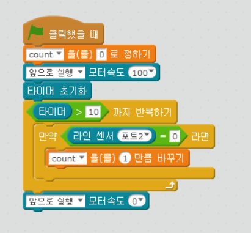
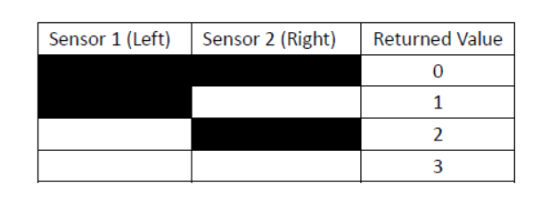

chapter 15: 라인 숫자 세기
========================================

라인트레이서 센서를 이용해서 라인갯수를 세는 프로그램을 짜보자.
알고리즘은 다음을 참고한다.

Declare a variable.
Move forward.
Loop:
---- If we see a line
---- ---- Add one to the variable.
End Loop

추가 과제
-------------------------
1.변수값을 확인 할 수 있는 블락을 사용해서 표시하세요.

2.여기서 변수값이 틀릴것이다. 어떻게 하면 변수값을 정확히 맞출수 있는가.( 0,1,2 모두 Black line)

