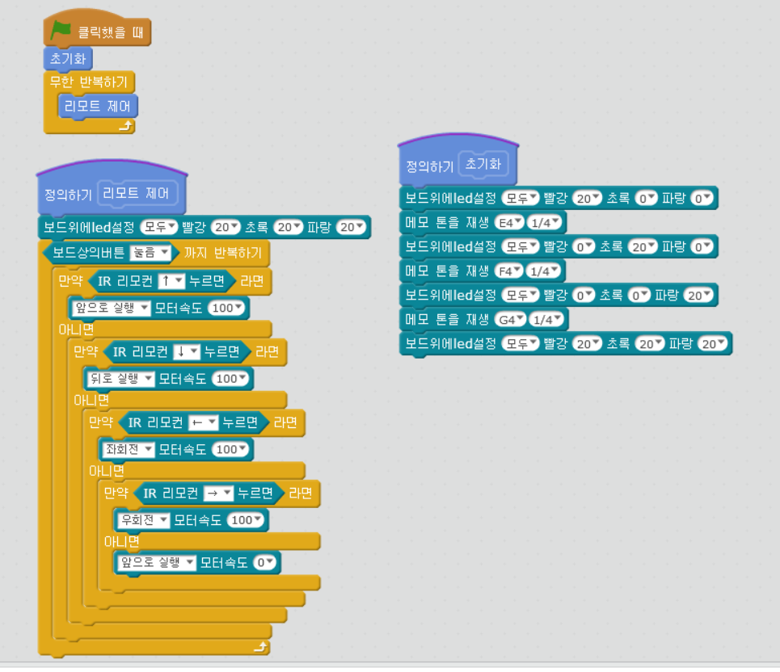

chapter 16: 엠봇 디폴트 함수프로그램 사용하기
==============================================

mblock 및 스크래치에서 기본으로 제공하는 함수 만들기를 사용하여
다음과 같이 설정해 보자.
초기화 하기
리모트 컨트롤 하기
라인트레이서 하기
회피프로그램 하기

추가 과제
-------------------------
1.라인트레이서 프로그램 하기

2.회피 프로그램 하기

3.회피 프로그램 하기

