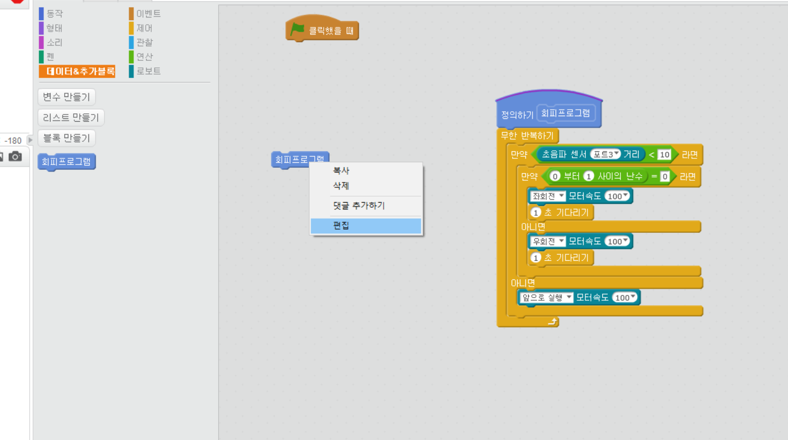
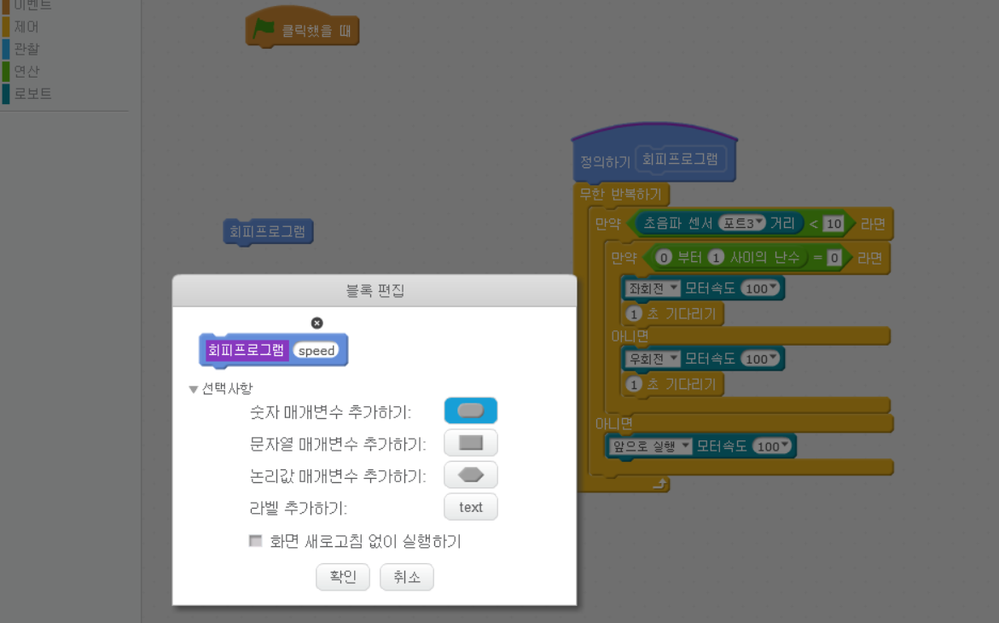
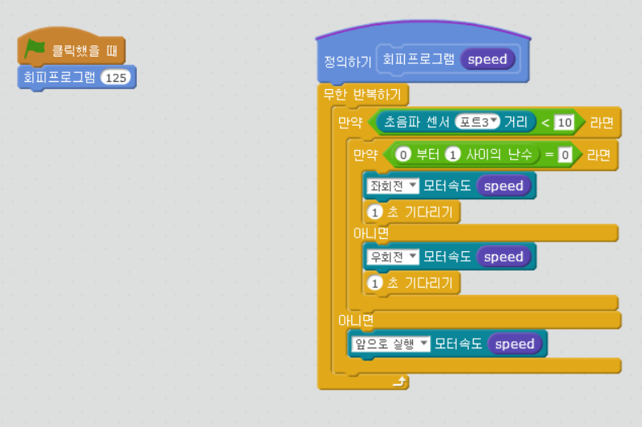

chapter 17: 함수와 파라미터을 활용한 회피프로그램
==============================================

함수 만들기와 함수내에서 파라미터 생성법을 알아보도록 하자.
기본으로 회피 프로그램을 만든다.

회피 프로그램 블럭을 클릭하고 우클릭하면 편집이 나온다.
편집에서 숫자 편집을 클릭하고 숫자로 쓸 변수명을 넣어 주면 된다.

그리고 함수에 넣어줄 숫자를 넣어주면 숫자값이 일괄로 적용된다.

추가 과제
-------------------------
1.함수에 다른값을 넣어서 실행해 보자.

2.방향을 나타내는 변수를 넣어 보자. 0 : left , 1: right ,2 : random

3.다른 함수를 하나 만들어 보자.

