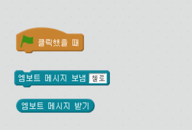
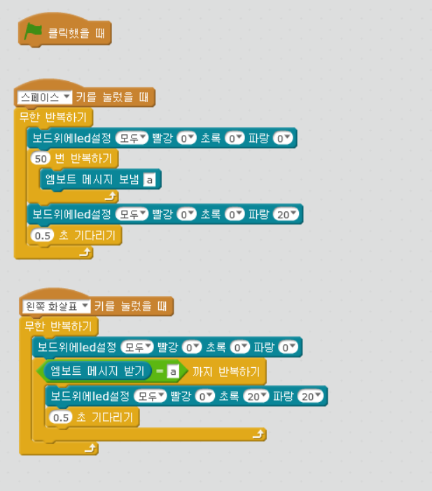
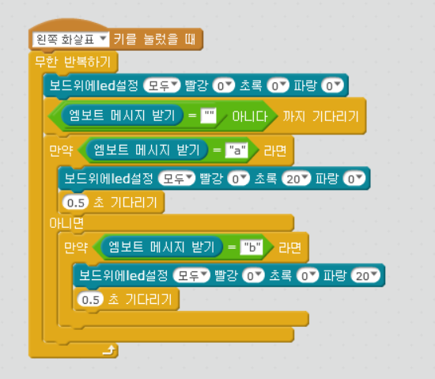

chapter 18: IR 통신하기
==============================================

엠봇은 IR 수신과 동시에 발신도 가능하다.
따라서 엠봇 상호간 통신도 가능하다.
엠블럭에서 IR 관련된 블럭은 다음 2개이다.

다음처럼 프로그램 해보도록 하자.

아래처럼 위에는 송신측이고
아래는 수신측 엠봇이다.

멀티플 메세지를 받을 경우에는 다음처럼 처리하면 된다.

추가 과제
-------------------------
1.한쪽 엠봇은 초음파 센서에서 측정한 거리를 보내고 다른쪽은 센서값을 받아서 다른 mblock 프로그램에 표시하도록 하자.

2.1번에 보낸 센서값을 2번에서 받아서 자기가 측정한 값과 비교해서 교정하도록 프로그램 해보자.

3.2대의 엠봇이 나란히 라인트레이싱을 하다가 첫번째 멤봇이 장애물을 만나면 멈추고 2번에게도 멈추도록 프로그래밍 해보자.

