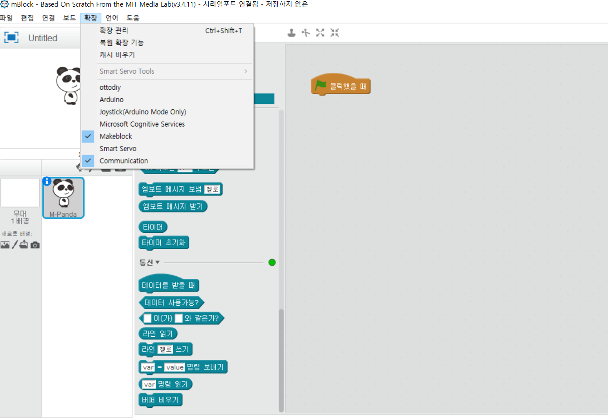

chapter 19: 시리얼 통신하기
==============================================

mblock의 확장- 통신을 선택하면 다음 그림처럼 통신관련 블럭이 올라온다.

이것을 사용하게 되면 PC- 엠블럭간의 통신을 할 수 있다.
아두이노 IDE의 경우 아두이노 보드와 PC간 시리얼 통신을 하는 원리와 동일하다.

나중에 좀더 자세히 통신에 대해서 배우도록 하자.

추가 과제
-------------------------
1. to be continued ....

