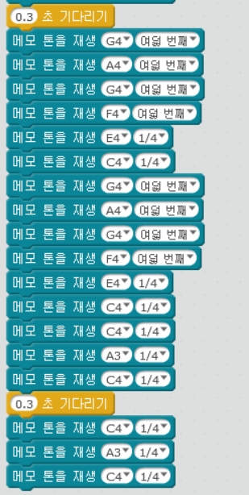

chapter 2: 음악연주하기
===========================

기본 연주 프로그램을 작성해 보도록 하자.

2.1 음악연주
-------------------

기본적으로 다음 블락을 이용한다.

음악소리는 여러개를 선택할 수 있다.

그리고 소리의 길이도 조정할 수 있다.

블락은 복사가 가능하다. 여러개를 다시 생성할때는 복사를 이용하는것이 편하다.

.. image:: ./img/chapter2-4.png

다음처럼 자기가 원하는 음악을 만들어 보자.

2.2 과제
-------------------
 1.메리 크리스 마스 음악을 만들어 보자.

