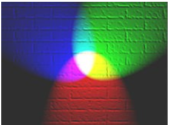
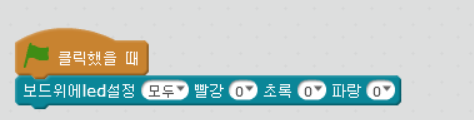
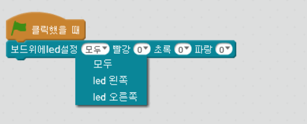
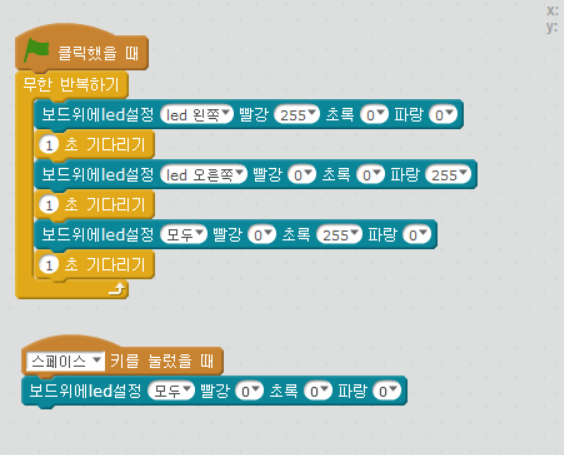

chapter 3: LED 표시하기
=======================

3.1 LED Display
-------------------

엠봇에는 2개의 RGB LED가 있다.
Red- Green -Blue  색깔을 섞어서 다양한 색깔을 얻을 수 있다.
각 값은 0 ~ 255값을 넣을 수 있다.

블럭은 다음과 같이 보드위에 LED설정 블럭을 쓰면 된다.

다음 그림과 같이 왼쪽 오른쪽 모두 선택 할 수 있다.

경찰차처럼 깜박이는 LED를 만들어 보자.

계속 반복되는 LED를 설정하기 위해서는 무한반복 블럭을 사용했고
한쪽 LED가 켜지고 잠시 시간을 두고 오른쪽 LED를 켜도 되고
나중에는 동시에 다 녹색으로 켜는 것도 가능하다.

3.2 자기만의 LED
-------------------

1.각자 LED 득성을 활용하여 다양한 LED 동작을 만들어 보자.

2.그리고 앞장에서 배운 음악을 함께 플레이 하면서 LED를 켜보자.

