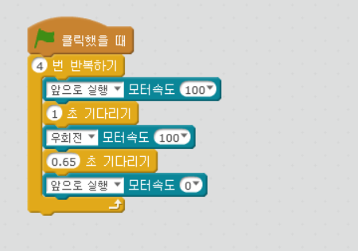

chapter 4: 움직이기
=======================

4.1 사각형안에서 움직이기
---------------------------

현재 mblock IDE 상태에서 진행되는 프로그램이다.

이 장에서는 다음 블럭을 쓰게 된다.

전후좌후로 0~ 255 값을 넣을수 있으며 방향에 마이너스 값은 반대 방향을 의미한다.

M1 모터는 앞에서 봤을때 오른쪽 M2 는 왼쪽 모터바퀴를 의미한다.

스피드 100으로 했을경우 오른쪽 회전을 90도 회전하려면 0.65초가 든다는고 테스트 결과 나왔다.
따라서 사각형을 그리기 위해서는 다음처럼 프로그램을 해야 한다.

4.2 색다른 사각형
-------------------

1.사각형 그리기 시작할때 소리가 나오도록 하고
 움직일때 일정한 음악으로 바꾼후
회전할때 다른 음악으로 설정하는 실습을 해보자.

