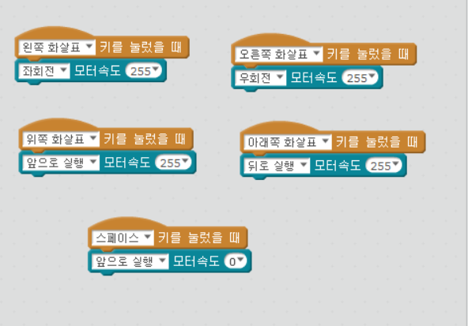

chapter 6: 엠봇 레이싱
=======================

이번 장에서는 키보드로 조정하는 mbot을 만들어 보자.

키보드의 상,하,좌,우 버튼에 대해서 각각 mbot 조정 버튼을 할당하자.

자기만의 mbot 레이서 만들기
-----------------------------------

1.각 버튼에 따라서 LED 좌,우,또는 직진에 대해서 추가해 보자.

2.직진을 경우, 좌,우 회전일 경우 각각 음악을 넣어 보자.

