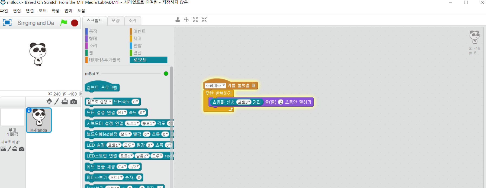
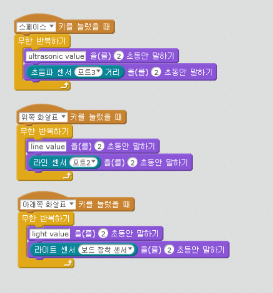

chapter 8: 센서값 읽기
========================================

mbot에서 센서값 읽고 처리하는 법을 배우도록 하자.
다음처럼 판다가 말하는 블럭을 이용해 보자.

연결- 펌웨어업그레이드 한후 시작한다.

현재 mbot port 3에 초음파 센서가 연결되어 있다.
그래서 다음처럼 초음파 센서값을 읽어서 앞에서 진행했던 블럭에 넣도록 해보자.

다음처럼 각 키에 따라서 다르게 설정되는 센서값을 읽어 보도록 하자.

나중에 아두이노 보드 센서 읽기 시간에 더 자세한 내용을 배웁시다.

mbot 센서값 동작하기
-------------------------
1.동시에 2개의 센서값을 읽는 프로그램을 짜보도록 하자.

2.동시에 모든 센서(3개를) 표시할 수 있는 방법을 알아 보자.

