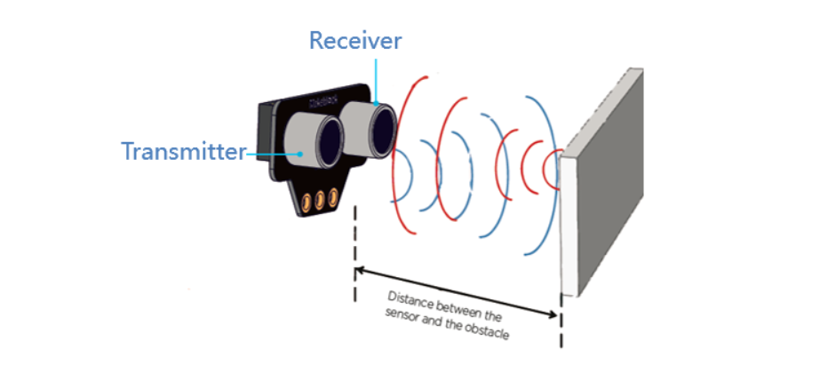
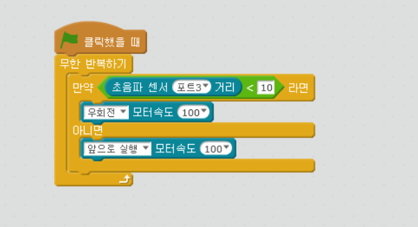
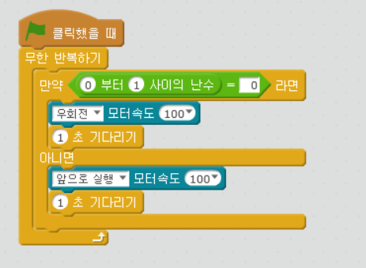

chapter 9: 초음파 센서
========================================

초음파 센서에 대해서 알아보도록 하자.
초음파 센서는 한쪽의 눈에서 초음파을 쏘면 다른쪽에서 받아서 측정시간으로 거리를 계산하는 것이다.

다음의 프로그램 로직을 알아 보도록 하자.

Forever:
---- If an object is detected
---- ---- Turn to a new direction
---- Else
---- ---- Go forward

다음은 임의의 값(0,1)을 생성해서 그 값에 따라서 동작하도록 만들어 보자.

초음파 센서 활용하기
-------------------------
1.위에 프로그램을 동시에 할수 있게 만들어 보자.

2.사물이 너무 가까이 있으면 멈추고 뒤로 가로록 하고 너무 멀리 있으면 앞으로 이동하도록 하고
   너무 가까이나 너무 멀리 있지 않으면 멈추도록 프로그램을 해보자.

3.2번에서 한 프로그램을 다른 속도록 한번 해보자.

